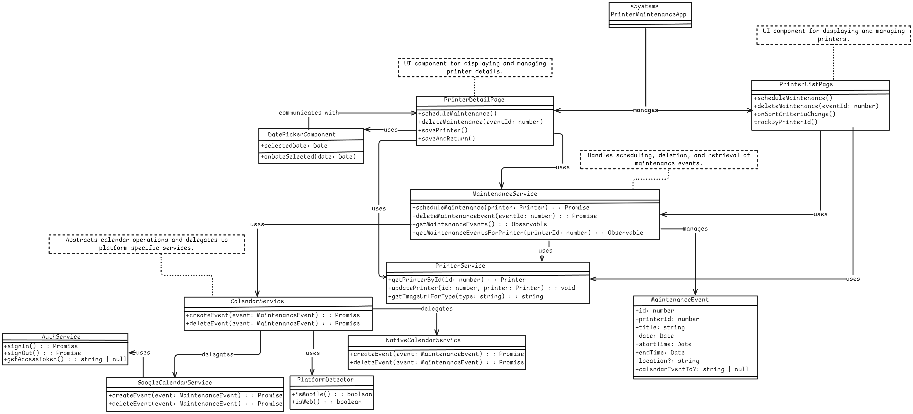

## Overview

The **Printer Maintenance App** is a cross-platform application designed to manage and schedule maintenance events for printers. It seamlessly integrates with **Google Calendar** for web applications and utilizes the **Native Calendar** on mobile devices (iOS and Android) through the `cordova-plugin-calendar`. This ensures that maintenance events are efficiently tracked and managed across all platforms.

### Why the Use of Google Calendar?

At first, it was because I couldn't find a plugin that could provide native integration, due to `capacitor-calendar `being deprecated, then after integrating it, I found that `cordova-plugin-calendar` works natively, and since google calendar was already integrated, and web apps don't have "native" calendars, i took the change to use them both, cordova-plugin for IOS and Android and google-calendar for the Web App with the use of an interface as shown below.

## Architecture

### Block Definition Diagram

The following diagram provides a visual representation of the application's architecture, detailing the core components, their responsibilities, and interactions.

#### Diagram Explanation:

* **Core Components:**
  * **MaintenanceService:** Handles the scheduling, deletion, and retrieval of maintenance events.
  * **CalendarService:** Abstracts calendar operations and delegates them to either `GoogleCalendarService` or `NativeCalendarService` based on the platform.
  * **GoogleCalendarService:** Integrates with Google Calendar API for web platforms.
  * **NativeCalendarService:** Utilizes the device's native calendar APIs on mobile platforms.
  * **AuthService:** Manages user authentication and authorization for GoogleCalendar.
  * **PrinterService:** Manages printer-related data and operations.
  * **DatePickerComponent:** UI component for selecting dates in the printer details page.
* **Models:**
  * **MaintenanceEvent:** Represents a maintenance event with details like title, date, time, and associated printer.
  * **Printer:** Represents a printer with attributes like type, commissioning date, and image URL.
